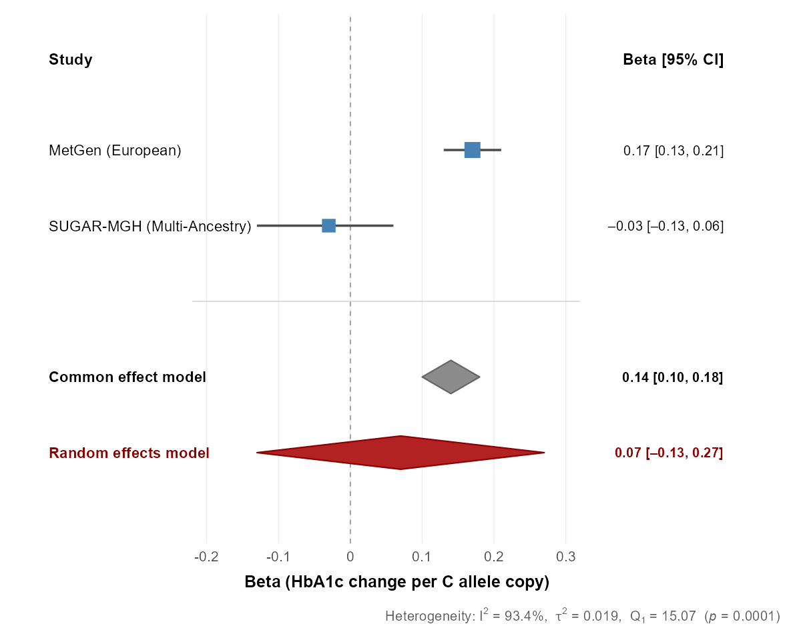
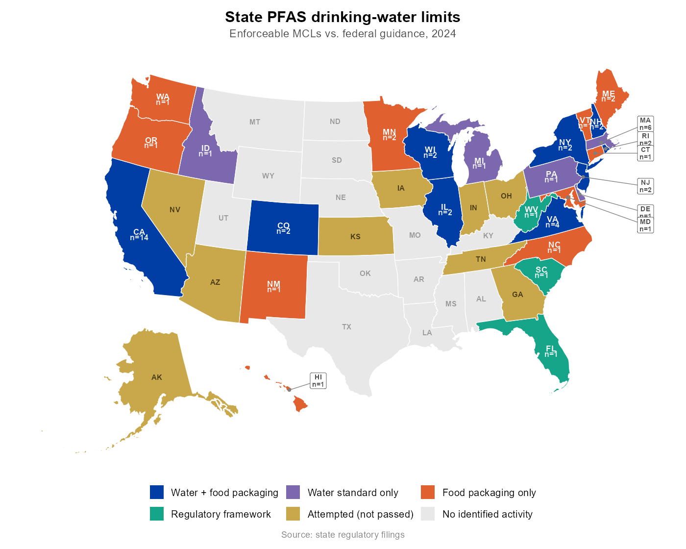
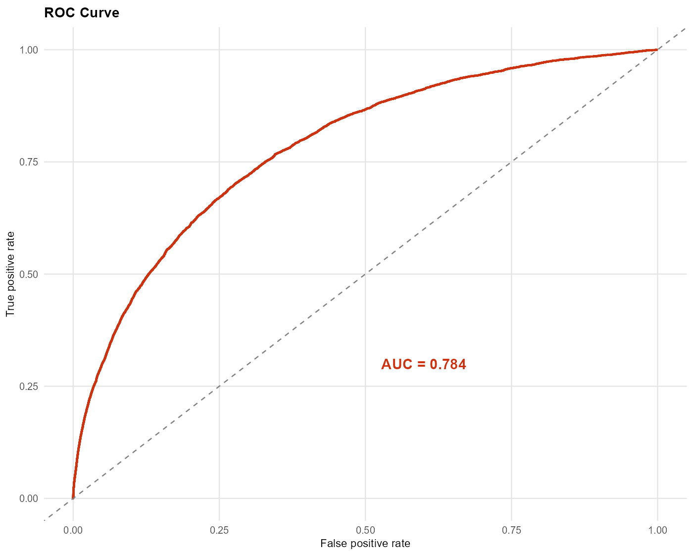

::: {.column-page}

::: {.grid .hero-block}

::: {.g-col-lg-7 .g-col-12 .hero-lead}

[Statistics you can trust — from someone who's generated the data.]{.hero-title}

I'm Jonathan Muniz, completing a Master's in Biostatistics after six years in pharmaceutical and research labs. I work in R, SQL, and Python pairing statistical rigor with the hands-on scientific experience to know where a dataset really comes from.

[View Projects](projects.qmd){.btn .btn-primary .btn-lg role="button"}
[About Me](about.qmd){.btn .btn-outline-secondary .btn-lg role="button"}

:::
::: {.g-col-lg-5 .g-col-12 .hero-figure}

```{=html}
<div class="xfade">
  
  
  
</div>
```

*Selected work — meta-analysis, environmental policy mapping, and clinical prediction.*

::: 

:::

## What I bring

::: {.grid .bring-strip}

::: {.g-col-md-4 .g-col-12}
**Trained as a biostatistician** — study design, statistical modeling, and enough judgment to know what a dataset can and can't answer.
:::

::: {.g-col-md-4 .g-col-12}
**R and Python, in production** — tidyverse and ggplot2 pipelines in R, plus a [live PyShiny dashboard](https://jonathanmuuf.shinyapps.io/health_atlas/) you can click through right now.
:::

::: {.g-col-md-4 .g-col-12}
**Six years at the bench** — with roots in biology and pharmacy, I know how biomedical data actually gets made: the protocols, the instruments, the messy parts nobody logs.
:::

:::

## Where my work lives

- 🔗 [GitHub](https://github.com/Jonathanmuniz13) — code and reproducible analyses
- 🔗 [Kaggle](https://www.kaggle.com/themuniz) — notebooks and competitions

*Open to data science and biostatistics roles — [get in touch](contact.qmd).*

:::