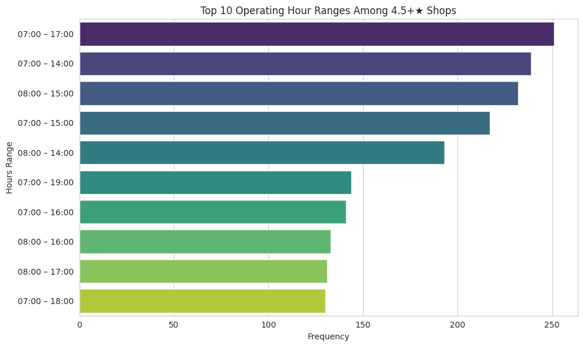
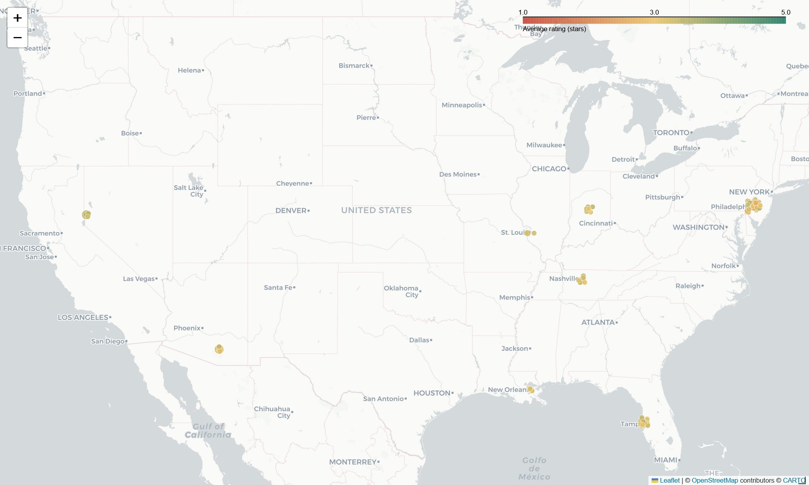
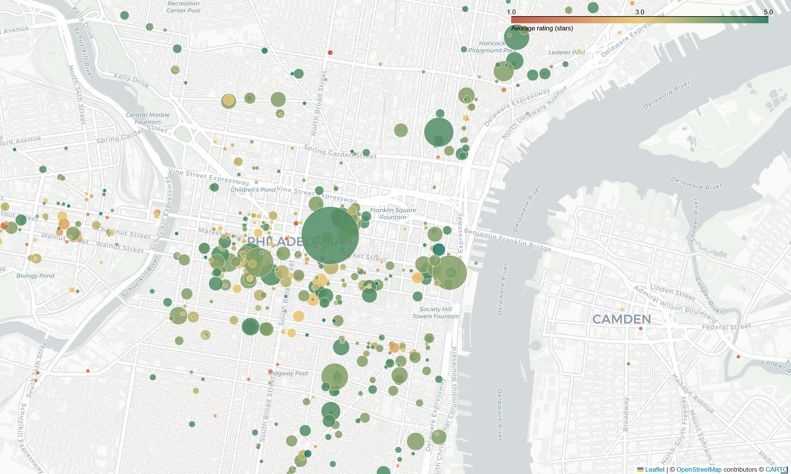
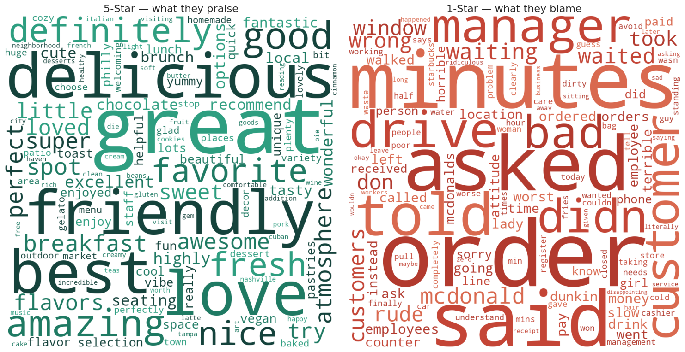

## The brief

CoffeeKing, a venture-backed coffee startup, needed data-driven guidance on three launch decisions: where to open, when to open, and what makes a visit five-star. The raw material was Yelp's Open Dataset, multi-gigabyte JSON files of businesses, reviews, and users, and the task was to turn that firehose into a short list of actions leadership could actually run with.

This is the project where I work at industry scale with a modern stack. The coffee domain is just the substrate; the transferable story is the engineering and the translation from messy data to prioritized recommendations.

## Data and pipeline

A deliberate two-stage pipeline kept the heavy lifting off the cluster.

1. **Stage 1 (Google Colab).** Stream-load the multi-GB `business.json`, `review.json`, and `user.json`, filter to the *Coffee and Tea* category, explode the nested business-hours structure, and write three Parquet shards.
2. **Stage 2 (Databricks).** Load the shards into the lakehouse as Delta tables and run the analysis in Spark SQL and Python.

The working tables:

| Table | Rows | Role |
|---|---|---|
| `coffee_reviews` | ~442K | Sentiment and demand signal |
| `coffee_shops` | ~6.7K | Supply and quality landscape |
| `coffee_users` | ~259K | Reviewer engagement |

The unglamorous engineering was the real work: parsing the inconsistent business-hours JSON, deriving ZIP-level rollups, building reusable temp views, and handling genuine data-quality landmines, including roughly 1,300 shops whose hours were placeholder ("Closed all week") or missing, which I flagged rather than silently averaging over.

## Three questions, answered with SQL and NLP

Three launch decisions drove the analysis, each answered by one figure below: **when** should CoffeeKing open, **where** should it open, and **what** turns a visit five-star?

**Q1. When are the best-rated shops actually open?** Exploding and standardizing per-day hours for shops rated 4.5★ and above showed top performers cluster in 7 AM to 5 PM windows, peaking on weekend mornings, the profitable demand window CoffeeKing should staff for.

{fig-alt="Horizontal bar chart of the ten most frequent operating-hour ranges among shops rated 4.5 stars or higher, with 7 AM to 5 PM the most frequent."}

**Q2. Where is coffee saturated but mediocre?** A ZIP-level cut for high shop density but a low average rating surfaces the "lots of competition, mediocre execution" markets a newcomer can disrupt. At a strict bar of 20 or more shops averaging 3.5★ or below, twelve ZIPs qualify, led by Tampa (33607, 33612, 33511, 33578), Philadelphia (19102, 19406, 18901), and Nashville (37214, 37211), with Tucson (85719), Reno (89503), and the Indianapolis suburbs (46038). Loosening to 10 or more shops widens the field to roughly 95 ZIPs, mapped below.

The national view below, colored by average rating and sized by review volume on the same scale as the metro map, is the figure produced in the Databricks notebook.

{fig-alt="Map of the United States with amber and orange circles clustered over Tampa, Philadelphia, Nashville, Tucson, Reno, Indianapolis, St. Louis, and New Orleans, each marking a saturated, low-rated ZIP code."}

↔ Explore the interactive national map

<iframe src="national.html" width="100%" height="540"
        style="border:1px solid #d8e3dd; border-radius:8px; margin-top:0.75rem;"
        loading="lazy" title="Interactive national coffee-desert map"></iframe>

Zooming into Philadelphia, shown as a representative case rather than the worst (that is Tampa), exposes the texture the ZIP averages hide: shop by shop, each point colored by its own rating and sized by review volume.

{fig-alt="Street-level map of the Philadelphia metro area. Each coffee shop is a point colored from red (low rating) to green (high rating) and sized by review count, densest in Center City and South Philadelphia."}

↔ Explore the interactive metro map

<iframe src="metro-philly.html" width="100%" height="540"
        style="border:1px solid #d8e3dd; border-radius:8px; margin-top:0.75rem;"
        loading="lazy" title="Interactive Philadelphia coffee-shop map"></iframe>

**Q3. What separates a five-star visit from a one-star one?** Tokenizing a balanced sample of 1★ and 5★ reviews (stopword filtering, term-frequency and TF-IDF, word clouds) produced a sharp contrast. Five-star language is about product and people ("delicious," "friendly," "staff"), while one-star language is about process failures ("order," "minutes," "never," "asked"), that is, service speed and errors, not the coffee itself.

{fig-alt="Two word clouds side by side. The five-star cloud emphasizes product and friendliness words; the one-star cloud emphasizes service-and-process words like order, waited, minutes, and rude."}

A correlation study added a useful null result: ZIP-level shop density barely relates to average rating (r ≈ 0.19), so saturation alone does not predict quality; execution does.

## From analysis to recommendations

The project ended where stakeholder work should, with prioritized actions, not just charts.

1. **Fix the data first.** Audit and correct the placeholder or missing operating hours before making consumer-facing decisions on them.
2. **Staff to the demand curve.** Align hours and promotions to the 7 AM to 5 PM peak, with weekend-morning emphasis.
3. **Enter underserved ZIPs.** Target the high-density, low-rating pockets the analysis surfaced.
4. **Compete on service speed.** The sentiment analysis says slow or incorrect service is the dominant driver of one-star reviews, so it is the highest-leverage operational fix.

## Why it matters

This is end-to-end analytics at scale: raw multi-GB JSON, a Spark pipeline, SQL and NLP analysis, and a deck of ranked recommendations a non-technical leadership team can act on. The translation step, turning 442K rows into four decisions, is the part most analyses skip and most hiring managers actually want to see.

## Limitations

Stated honestly: Yelp data is self-selected and geographically skewed toward large metros, so it is a proxy for demand rather than a census. Sentiment was measured with frequency and TF-IDF methods rather than a trained model. And the operating-hours findings are constrained by the data-quality gaps noted above.

## Links

- 📊 [View the stakeholder deck](https://docs.google.com/presentation/d/e/2PACX-1vQ2gc_SUFx9DOQhVTEV_O6wOZNtwTZ88puy1h4RHcJ74mXOzl79MKs3s2L8RtxPMfgO8bbm1004bpx1/pub?start=false&loop=false&delayms=3000) is the prioritized recommendations, presented for leadership
- 💻 [Full Databricks notebook](notebook.html), exported HTML snapshot of the analysis
- 💻 [Code on GitHub](https://github.com/Jonathanmuniz13/coffeeking-yelp-analytics/blob/main/coffeeking_yelp_analysis.ipynb)
- 🗄️ Data: [Yelp Open Dataset](https://www.yelp.com/dataset)
