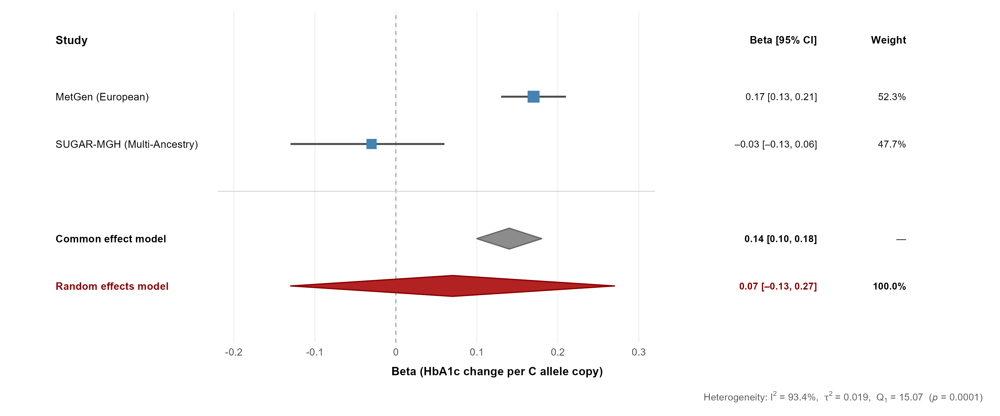
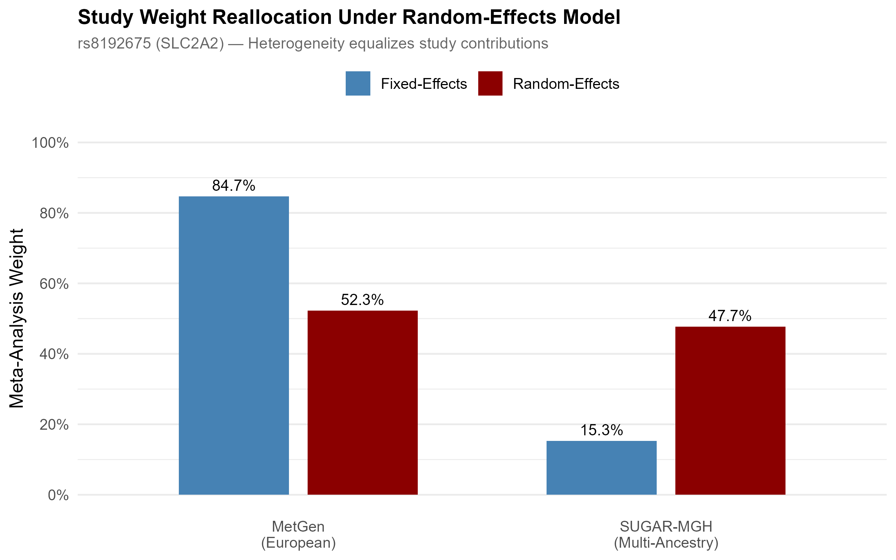
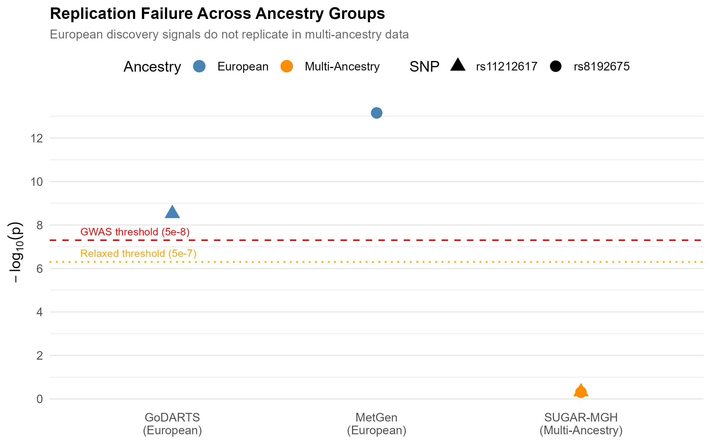

## The question

Metformin is the first-line drug for type 2 diabetes, yet glycemic response varies widely between patients. Several of the genetic markers used to explain that variation were discovered almost entirely in European-ancestry cohorts, which raises a question precision medicine cannot ignore: do those markers replicate in other populations, or are they European-specific?

I ran a candidate-SNP meta-analysis to find out, focusing on the two best-known markers for metformin response: `rs8192675` (*SLC2A2*) and `rs11212617` (near *ATM*).

## Data

Three published GWAS, pulled from the EBI GWAS Catalog, totaling 22,766 participants.

| Study | Ancestry | N | Role |
|---|---|---|---|
| MetGen Consortium | European | 10,577 | Discovery (*SLC2A2*) |
| GoDARTS / UKPDS | European | 3,920 | Discovery (*ATM*) |
| SUGAR-MGH | Multi-ancestry | 8,269 | Replication |

SUGAR-MGH was the only study with full genome-wide summary statistics, so I extracted the candidate SNPs by genomic position before loading. To go beyond the two headline variants, I also ran region-based queries across the core metformin pharmacogenes, *SLC22A1* (OCT1, hepatic uptake) and *SLC47A1* (MATE1, renal excretion), scanning roughly a million rows of summary statistics for any signal in those loci.

## Method

The core analysis is an inverse-variance-weighted meta-analysis of the continuous *SLC2A2* signal, built around the QC and modeling steps that decide whether a result is trustworthy.

- **Allele harmonization.** I confirmed effect alleles matched across studies and flipped the SUGAR-MGH *ATM* estimate to align reference alleles.
- **Fixed-effects (IVW) and random-effects (DerSimonian-Laird) models,** with Cochran's *Q* and *I²* to quantify between-study heterogeneity.
- **Manual derivations verified against `meta::metagen()`.** I computed the weights, pooled estimates, *τ²*, and *Q* by hand from first principles and checked them against the package output. They match to four decimals.
- **Fisher's combined p-value** as a sensitivity analysis, to combine evidence for the *ATM* SNP where an outcome-scale mismatch (binary OR versus continuous HbA1c) ruled out a formal pooled effect.
- **A post-hoc power analysis,** to test whether a non-result was actually informative or just underpowered.

## Key result

The *SLC2A2* effect reverses direction between cohorts: +0.17 HbA1c units per C allele in the European discovery sample, and −0.03 in the multi-ancestry replication sample. That reversal drives the entire finding.

{fig-alt="Forest plot showing MetGen at 0.17 and SUGAR-MGH at negative 0.03, with a non-significant pooled random-effects diamond spanning zero."}

The consequence shows up sharply in the two pooled models:

| Model | Pooled β (HbA1c per C allele) | 95% CI | p-value |
|---|---|---|---|
| Fixed-effects (IVW) | 0.139 | [0.10, 0.18] | 1.35 × 10⁻¹³ |
| Random-effects (DL) | 0.073 | [−0.13, 0.27] | 0.47 |

Heterogeneity is extreme: Cochran's *Q* = 15.07, *I²* = 93.4%, *τ²* = 0.019. A marker that looks overwhelmingly significant under the homogeneity assumption becomes statistically null once between-study variance is modeled properly.

The mechanism is visible in how the models weight the two studies. Fixed effects lets the larger European study dominate at 84.7%. Random effects, once it accounts for the heterogeneity, equalizes the contributions to roughly 52 / 48, and the signal disappears.

{fig-alt="Grouped bar chart comparing fixed-effects and random-effects weights for the two studies, showing the European study's weight dropping and the multi-ancestry study's weight rising."}

Neither SNP crossed genome-wide significance in the multi-ancestry cohort, even at the relaxed pharmacogenomic threshold. The European discovery signals sit far above the line; the replication attempts sit near zero.

{fig-alt="Scatter plot of negative log-10 p-values showing MetGen and GoDARTS above the genome-wide threshold and SUGAR-MGH far below it."}

## Was the non-replication real, or just underpowered?

This is the question that decides whether the finding means anything, so I answered it directly with a post-hoc power calculation. Given SUGAR-MGH's precision, its power to detect the European-sized *SLC2A2* effect at genome-wide significance was only about **3%**. Reaching 80% power would have required roughly **26,000 participants, about three times the sample available.**

That result cuts honestly in both directions, which is the point of running it. The non-replication is not clean proof of a true ancestry difference, because the replication cohort was underpowered for a strict genome-wide test. But the effect-direction reversal and the extreme heterogeneity are not artifacts of power, and at a nominal threshold the study was well powered (94%). The most defensible reading is that a single universal effect size is not supported, and that adequately powered multi-ancestry cohorts are needed to say more.

## Why it matters

This small analysis mirrors a real problem in global drug development.

1. **Companion diagnostics.** A test built on *SLC2A2* genotype alone would perform well in European patients and could mislead for patients of other ancestries.
2. **Trial diversity.** It is a concrete illustration of why regulators have pushed for ancestry diversity in clinical trials. A marker validated in one population may not predict response in another.
3. **Stratified prescribing.** The heterogeneity argues for an ancestry-aware rather than universal model of metformin pharmacogenetics.

## Limitations

I would rather state these than have a reviewer find them. Only two studies were available for the primary pooled estimate (k = 2), which limits the precision of the *τ²* estimate. The association-only files restricted me to a candidate-SNP rather than a genome-wide approach. The *ATM* comparison is descriptive only, because of the binary-versus-continuous outcome mismatch. And as the power analysis makes explicit, the replication cohort was underpowered for a strict genome-wide test.

## Links

- 📄 [Read the full report](metformin_meta_analysis_final.pdf) covers methods, the hand-derived calculations, the pharmacogene scan, and the full discussion
- 💻 [Code on GitHub](https://github.com/Jonathanmuniz13/metformin-trans-ethnic-meta)
- 🗄️ Data: EBI GWAS Catalog accessions `GCST004522`, `GCST000927`, `GCST90269867`
